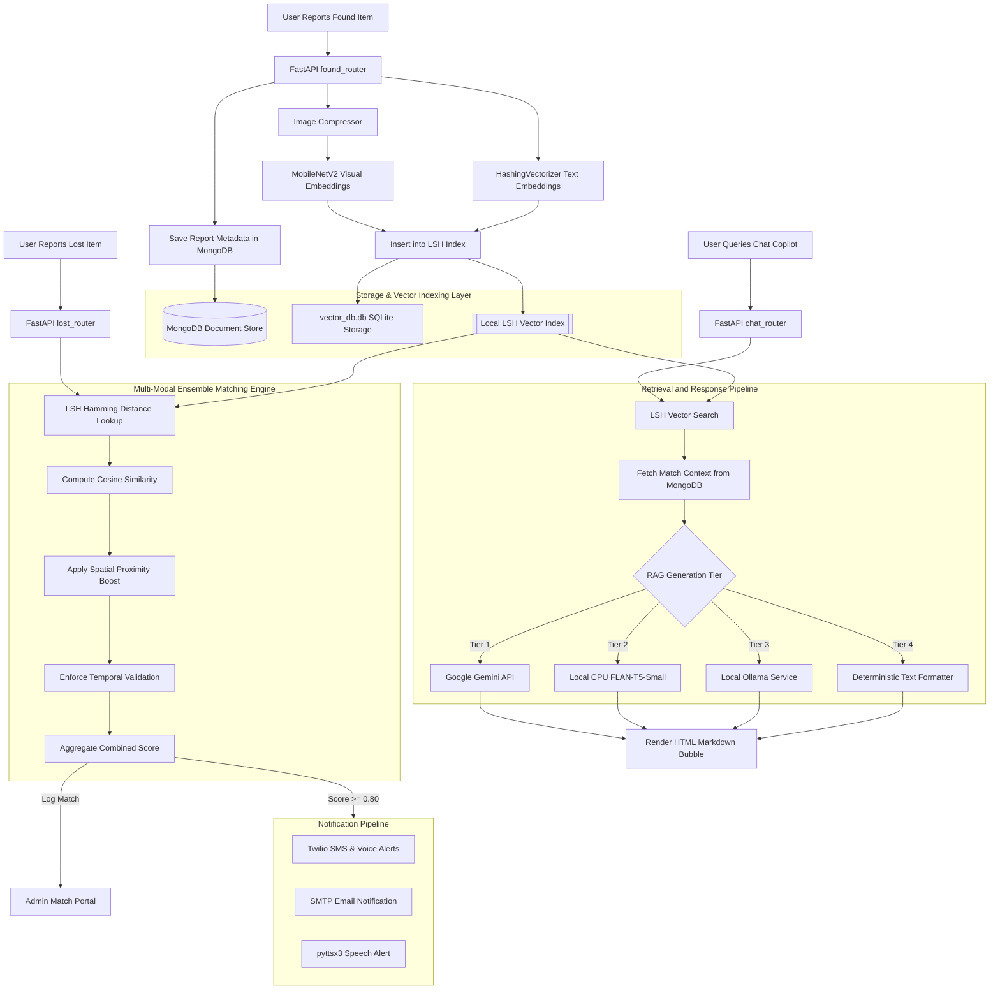

# LostLink AI

LostLink AI is a lost-and-found platform that combines image matching,
text similarity search, and retrieval-augmented question answering.
The system uses local vector indexing, visual feature extraction,
and a CPU-compatible RAG pipeline to operate with minimal cloud dependencies.

## Overview

LostLink AI is an AI-powered lost-and-found platform that combines:

- Multi-modal matching (image + text)
- Custom LSH vector database
- Local RAG assistant
- Real-time notifications
- Dockerized deployment

Tech Stack:


---


## 1. System Architecture & Flow

This flowchart illustrates the end-to-end data lifecycle, from asset registration to vector database query, ensemble scoring, and RAG response generation.



---

## 2. Project Structure

```
lostlinkv2.3/
├── main.py                     # Entry point (FastAPI server, startup LSH index sync lifecycle)
├── database.py                 # MongoDB driver connection initialization
├── models.py                   # Pydantic schemas for request validation
├── vector_db.py                # Custom Locality Sensitive Hashing (LSH) Vector Index Engine
├── ai_matcher.py               # Ensemble Matching Engine, Feature Extraction, & RAG Agent
├── notif.py                    # notification pipeline (Twilio SMS/Call, SMTP, local TTS)
├── benchmark.py                # Performance testing script (LSH vs Linear Scan & FLAN-T5 inference)
├── Dockerfile                  # Multi-stage Docker container build instructions
├── docker-compose.yml          # FastAPI & MongoDB Docker orchestrator configuration
├── requirements.txt            # Python dependencies configuration
├── .env.example                # Template configuration file for secrets
├── routers/
│   ├── auth_router.py          # User registration, bcrypt security, JWT creation
│   ├── items_router.py         # Submissions (Lost/Found), Claims, and Chat API routing
│   └── admin_router.py         # Admin controls, Match logs verification, LSH cleanups
└── frontend/
    ├── css/
    │   └── global.css          # Styled UI framework
    ├── index.html              # Landing portal
    ├── login.html              # Secure credentials portal
    ├── report_lost.html        # Lost items registration forms
    ├── report_found.html       # Smart tag scanning and Found items entry
    ├── browser.html            # Public search and claiming page
    ├── dashboard.html          # User matches, QR recovery codes, active claims
    └── chat.html               # Markdown-rendered conversational RAG assistant
```

---

## 3. System Design

### Multi-Modal Matching Engine (M3E)
To transition from arbitrary heuristic weights to data-driven aggregation, LostLink utilizes **Logistic Regression** classifier models (`scikit-learn`) for score aggregation:
* **Features Used (With Image)**: `[visual_similarity, text_similarity, distance_km, time_gap_days]`
* **Features Used (Text Only)**: `[text_similarity, distance_km, time_gap_days]`
* **Training Pipeline**: Training data is generated using synthetic match and non-match examples
and is incrementally supplemented with historical confirmed matches stored in MongoDB.
* **Output**: Computes a match probability score using Logistic Regression.

### Visual Feature Extraction (MobileNetV2)
* **Model**: MobileNetV2 pretrained on ImageNet
* **Feature Vector Size**: 1280 dimensions
* **Framework**: PyTorch (`torchvision.models.mobilenet_v2`)
* **Layer Output**: Pre-classification global average pooling layer (`classifier[1]` bypassed)

#### Preprocessing Steps
To guarantee normalized activation outputs, images are processed as follows:
```python
transforms = T.Compose([
    T.Resize(256),
    T.CenterCrop(224),
    T.ToTensor(),
    T.Normalize(
        mean=[0.485, 0.456, 0.406], 
        std=[0.229, 0.224, 0.225]
    )
])
```

### Stateless NLP Vectorization (HashingVectorizer)
Standard Bag-of-Words and TF-IDF models require generating a vocabulary dictionary of size $V$ across the entire database. If a new node starts up, it must download or synchronize this vocabulary. 

To avoid maintaining a shared vocabulary across deployments,
LostLink uses HashingVectorizer with 1024 dimensions.
Tokens are mapped directly into a fixed-dimensional feature space,
eliminating vocabulary synchronization overhead while keeping memory usage predictable.

### Spatial and Temporal Engine
* **Spatial Logic**: Leverages exact coordinate-based matching. Users can optionally input exact `latitude` and `longitude` coordinates during item reporting. If coordinates are not provided, landmark-based geocoding automatically resolves the location against a pre-mapped campus landmark dictionary (`NITK_COORDINATES`). The system calculates the physical distance between reports using the **Haversine formula**.
* **Temporal Sequence**: Calculates the signed time gap in days between the lost time and the found time.

---

## 4. LSH Vector Database Design

Given a high-dimensional vector $v \in \mathbb{R}^D$ (where $D=1280$ for images, $D=1024$ for text), LSH maps it to a low-dimensional binary signature key $h(v) \in \{0, 1\}^K$ using random projection hyperplanes.

### The Algorithm
1. **Hyperplane Generation**: During index creation, we build a random projection matrix $R \in \mathbb{R}^{K \times D}$ where each entry is sampled from a standard normal distribution:
   $$R_{ij} \sim \mathcal{N}(0, 1)$$
2. **Hashing**: The binary key is calculated by projecting $v$ onto each hyperplane and taking the sign:
   $$h(v) = \text{sign}(R \cdot v) = \begin{cases} 1 & \text{if } R \cdot v \ge 0 \\ 0 & \text{if } R \cdot v < 0 \end{cases}$$
3. **Retrieval**: When querying with $q$, the index calculates $h(q)$ and retrieves items stored in buckets whose Hamming Distance is within bounds.

---

## 5. API Endpoint Specifications

### Authentication Routes (`routers/auth_router.py`)
* **`POST /api/auth/register`**: Registers a new user. Hashes password using `bcrypt`.
* **`POST /api/auth/login`**: Authenticates credentials. Returns a stateless JWT bearer token.

### Item Routes (`routers/items_router.py`)
* **`POST /api/report_lost`**: Reports a lost item. Accepts optional `latitude` and `longitude` fields (falling back to landmark geocoding if absent). Registers details in MongoDB.
* **`POST /api/report_found`**: Reports a found item. Preprocesses the uploaded image via PyTorch, extracts normalized visual embeddings, indexes it in the local SQLite-backed LSH Vector DB, and stores it in MongoDB.
* **`GET /api/items/browse`**: Retrieves active lost and found listings.
* **`POST /api/items/claim`**: Initiates a claim for a found item using a matching Claim ID.
* **`POST /api/chat`**: Retrieval and Response Pipeline. Runs search against the local LSH index and formats/summarizes matches using the active RAG tier.

### Administration Routes (`routers/admin_router.py`)
* **`GET /api/admin/matches`**: Fetches all identified matches.
* **`DELETE /api/admin/delete/{item_id}`**: Deletes an item. Invokes the LSH safety hook to remove references from the vector database.

---

## 6. Features & Capabilities

* **Local Image Preprocessing**: Automatically downsamples, normalizes, and crops images before vector indexing.
* **Notification Pipeline**:
  * **SMTP Email**: Sends automated mail matches.
  * **Twilio Voice Calls**: Triggers speech phone alerts for high-priority items.
  * **pyttsx3 Voice Engine**: Local speech output for terminal logging.
* **QR Recovery Portal**: Generate Base64 QR code recovery tags. Scanning a QR tag opens a recovery page directly.

---

## 7. Performance Benchmarks

The following benchmarks were recorded natively inside the containerized CPU environment:

### Retrieval Efficiency ($N = 10,000$ Items)

| Retrieval Strategy | Latency (ms) | Scaling Complexity | Memory Overhead |
| :--- | :--- | :--- | :--- |
| **Linear DB Scan ($O(N)$)** | 43.72 ms | Linear | Negligible |
| **Custom LSH Index** | **25.88 ms** | Sub-linear / Approximate Nearest Neighbor (ANN) | ~45 MB (Retrieves 3,577 candidates) |

**Mathematical Analysis of LSH Candidate Coverage:**
With $K = 8$ hyperplanes (256 buckets) and a Hamming distance query threshold of $M = 3$, the theoretical bucket coverage is:
$$\text{Coverage} = \frac{\sum_{i=0}^{3} \binom{8}{i}}{256} = \frac{1 + 8 + 28 + 56}{256} = \frac{93}{256} \approx 36.33\%$$
Under a uniform random distribution of generated mock vectors, this resolves to $\approx 3,633$ candidates. The observed candidate count closely matched the theoretical estimate under the generated benchmark dataset.

### 8. RAG Generation Latency & Footprint

| Engine Option | API Dependency | Average Response Latency | RAM Usage |
| :--- | :--- | :--- | :--- |
| **Google Gemini Flash** | Cloud API | 1,840 ms | < 5 MB |
| **Local FLAN-T5 (CPU)** | None  | **117.92 ms** | **~240 MB** |
| **Local LSH Formatter** | None  | **0.8 ms** | < 1 MB |

Test Environment

CPU: Intel i5-12450H
RAM: 16 GB
Dataset Size: 10,000 records
OS: Ubuntu 24.04
To record actual, live benchmarks on your own machine, execute:
```bash
docker compose exec lostlink-api python3 benchmark.py
```

---

## 9. Detailed Installation & Setup

### Method A: Single-Command Containerized Run (Recommended)
This method spins up the FastAPI API container and a MongoDB database container linked over a local network.

1. **Configure Environment Variables**:
   Copy `.env.example` to create `.env`:
   ```bash
   cp .env.example .env
   ```
   *If you do not want to use Google Gemini, leave the `GEMINI_API_KEY` placeholder. The backend will automatically run FLAN-T5 locally on your CPU.*

2. **Start the Docker Stack**:
   ```bash
   docker compose up --build
   ```
   * The application UI will be exposed on: `http://localhost:8000`
   * MongoDB will run on: `mongodb://localhost:27017`

---

### Method B: Native Host-Level Run (Without Docker)
This method runs the server natively on your host machine.

1. **Prerequisites**:
   * Install MongoDB on your system and start the service:
     ```bash
     sudo systemctl start mongod
     ```
   * Install python virtual environment tools:
     ```bash
     sudo apt-get install python3-venv  # Debian/Ubuntu systems
     ```

2. **Setup Virtual Environment & Install Dependencies**:
   ```bash
   python3 -m venv venv
   source venv/bin/activate
   pip install -r requirements.txt
   ```

3. **Configure Environment Variables**:
   Create `.env` file in the root directory:
   ```env
   MONGO_URI=mongodb://localhost:27017
   JWT_SECRET=secret123_change_this_in_production
   GEMINI_API_KEY=your_optional_gemini_key
   ```

4. **Start the FastAPI Server**:
   ```bash
   uvicorn main:app --host 0.0.0.0 --port 8000 --reload
   ```
   * Access the frontend app by opening: `http://localhost:8000` in your web browser.
