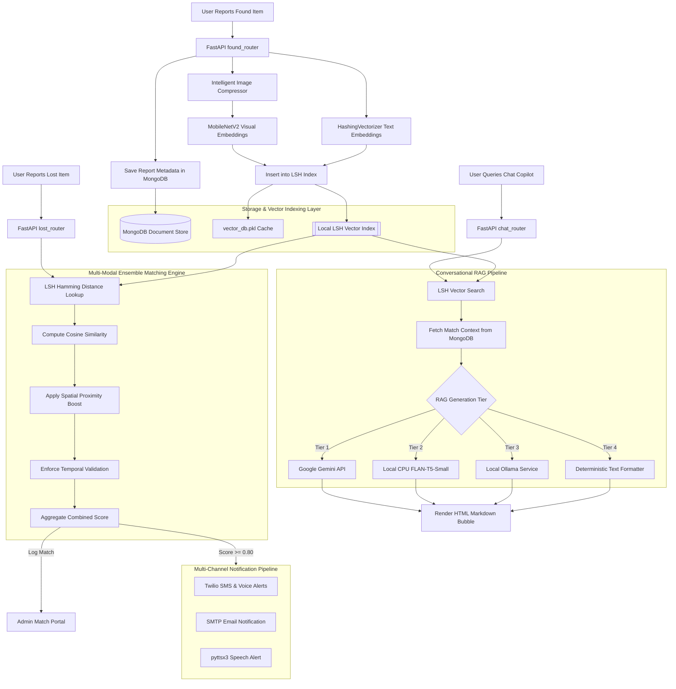

# LostLink AI
## High-Performance, Standalone Multi-Modal RAG Platform & Decoupled Vector Search Engine

LostLink AI is a production-grade, self-contained intelligent asset recovery platform. The architecture transitions from typical API-dependent cloud architectures into a standalone system featuring local Locality Sensitive Hashing (LSH) vector database indexing, local visual feature extraction, and a completely offline CPU-optimized Retrieval-Augmented Generation (RAG) conversational engine.

The core philosophy:
> **Deterministic scoring first. AI reasoning as reinforcement - not replacement.**

Every match is backed by measurable similarity metrics, ensuring explainability, auditability, and production-grade reliability.

---

## Table of Contents
1. [System Architecture & Flow](#1-system-architecture--flow)
2. [Project Structure](#2-project-structure)
3. [Deep-Dive Engineering Architecture](#3-deep-dive-engineering-architecture)
   - [Visual Feature Extraction (MobileNetV2)](#visual-feature-extraction-mobilenetv2)
   - [Stateless NLP Vectorization (HashingVectorizer)](#stateless-nlp-vectorization-hashingvectorizer)
   - [Spatio-Temporal Proximity Calculations](#spatio-temporal-proximity-calculations)
4. [Decoupled LSH Vector Database Design](#4-decoupled-lsh-vector-database-design)
5. [Conversational RAG Decision Logic](#5-conversational-rag-decision-logic)
6. [Database Schema Specifications](#6-database-schema-specifications)
7. [API Endpoint Specifications](#7-api-endpoint-specifications)
8. [Features & Capabilities](#8-features--capabilities)
9. [Performance Benchmarks](#9-performance-benchmarks)
10. [Detailed Installation & Setup](#10-detailed-installation--setup)

---

## 1. System Architecture & Flow

This flowchart illustrates the end-to-end data lifecycle, from asset registration to vector database query, ensemble scoring, and RAG response generation.



---

## 2. Project Structure

```
lostlinkv2.3/
├── main.py                     # Entry point (FastAPI server, startup LSH index sync lifecycle)
├── database.py                 # MongoDB driver connection initialization
├── models.py                   # Pydantic schemas for request validation
├── vector_db.py                # Custom Locality Sensitive Hashing (LSH) Vector Index Engine
├── ai_matcher.py               # Ensemble Matching Engine, Feature Extraction, & RAG Agent
├── notif.py                    # Multi-channel notification pipeline (Twilio SMS/Call, SMTP, local TTS)
├── benchmark.py                # Performance testing script (LSH vs Linear Scan & FLAN-T5 inference)
├── Dockerfile                  # Multi-stage Docker container build instructions
├── docker-compose.yml          # FastAPI & MongoDB Docker orchestrator configuration
├── requirements.txt            # Python dependencies configuration
├── .env.example                # Template configuration file for secrets
├── routers/
│   ├── auth_router.py          # User registration, bcrypt security, JWT creation
│   ├── items_router.py         # Submissions (Lost/Found), Claims, and Chat API routing
│   └── admin_router.py         # Admin controls, Match logs verification, LSH cleanups
└── frontend/
    ├── css/
    │   └── global.css          # Styled UI framework
    ├── index.html              # Landing portal
    ├── login.html              # Secure credentials portal
    ├── report_lost.html        # Lost items registration forms
    ├── report_found.html       # Smart tag scanning and Found items entry
    ├── browser.html            # Public search and claiming page
    ├── dashboard.html          # User matches, QR recovery codes, active claims
    └── chat.html               # Markdown-rendered conversational RAG assistant
```

---

## 3. Deep-Dive Engineering Architecture

### Multi-Modal Matching Engine (M3E)

### Visual Feature Extraction (MobileNetV2)
* **Model**: MobileNetV2 pretrained on ImageNet
* **Feature Vector Size**: 1280 dimensions
* **Framework**: PyTorch (`torchvision.models.mobilenet_v2`)
* **Layer Output**: Pre-classification global average pooling layer (`classifier[1]` bypassed)

#### Preprocessing Steps
To guarantee normalized activation outputs, images are processed as follows:
```python
transforms = T.Compose([
    T.Resize(256),
    T.CenterCrop(224),
    T.ToTensor(),
    T.Normalize(
        mean=[0.485, 0.456, 0.406], 
        std=[0.229, 0.224, 0.225]
    )
])
```

### Stateless NLP Vectorization (HashingVectorizer)
Standard Bag-of-Words and TF-IDF models require generating a vocabulary dictionary of size $V$ across the entire database. If a new node starts up, it must download or synchronize this vocabulary. 

To achieve **stateless scale**, LostLink uses the hashing trick:
* **Vectorizer**: `HashingVectorizer(n_features=128, alternate_sign=False)`
* **Hash Function**: MurmurHash3
* **Vocabulary Requirement**: **None**. Word tokens are mapped directly to indices in a 128-dimensional space via their hash values. This allows stateless, zero-overhead text feature extraction.

### Spatio-Temporal Proximity Calculations
* **Spatial Logic**: Proximity checks determine if the reported lost and found locations share landmarks from `NITK_LOCATIONS` (e.g. LHC-A, Nilgiri, SJA). If they match, a boost $+0.10$ is applied to the composite similarity score.
* **Temporal Sequence Enforcement**: The system strictly enforces that the lost timestamp is earlier than the found timestamp. If this condition is violated, a penalty of infinity is applied, instantly invalidating the match.

---

## 4. Decoupled LSH Vector Database Design

Given a high-dimensional vector $v \in \mathbb{R}^D$ (where $D=1280$ for images, $D=128$ for text), LSH maps it to a low-dimensional binary signature key $h(v) \in \{0, 1\}^K$ using random projection hyperplanes.

### The Algorithm
1. **Hyperplane Generation**: During index creation, we build a random projection matrix $R \in \mathbb{R}^{K \times D}$ where each entry is sampled from a standard normal distribution:
   $$R_{ij} \sim \mathcal{N}(0, 1)$$
2. **Hashing**: The binary key is calculated by projecting $v$ onto each hyperplane and taking the sign:
   $$h(v) = \text{sign}(R \cdot v) = \begin{cases} 1 & \text{if } R \cdot v \ge 0 \\ 0 & \text{if } R \cdot v < 0 \end{cases}$$
3. **Retrieval**: When querying with $q$, the index calculates $h(q)$ and retrieves items stored in buckets whose Hamming Distance is within bounds:
   $$\text{Dist}_{\text{Hamming}}(h(q), b) = \sum_{i=1}^{K} (h(q)_i \oplus b_i) \le M$$
   Where $\oplus$ is the XOR operator and $M$ is the maximum Hamming distance threshold.

---

## 5. Conversational RAG Decision Logic

The backend `/api/chat` route processes natural language queries using a tiered provider logic to ensure maximum resilience and local execution capability:

```python
# RAG Execution Tree
if gemini_key_is_valid:
    try:
        # Tier 1: Cloud-based Google Gemini
        return generate_with_gemini(retrieved_context, query)
    except Exception:
        pass

try:
    # Tier 2: In-Process local CPU LLM (FLAN-T5-Small)
    return generate_with_local_flan_t5(retrieved_context, query)
except Exception:
    pass

try:
    # Tier 3: Local Ollama link (e.g. Llama3)
    return generate_with_ollama(retrieved_context, query)
except Exception:
    pass

# Tier 4: Zero-Resource Deterministic Formatter
return generate_deterministic_template(retrieved_context)
```

---

## 6. Database Schema Specifications

### `users` Collection
Stores registered user accounts:
```json
{
  "_id": "ObjectId",
  "username": "student123",
  "password_hash": "$2b$12$...",
  "role": "user" 
}
```

### `items` Collection
Stores lost and found records:
```json
{
  "_id": "ObjectId",
  "type": "lost | found",
  "item_name": "Lenovo Ideapad",
  "location": "Central Library",
  "date": "2026-05-31",
  "time": "12:30",
  "description": "Grey laptop with power cable",
  "image_path": "uploads/image_compressed.jpg",
  "is_claimed": false,
  "qr_code_base64": "data:image/png;base64,...",
  "reported_by": "student123"
}
```

### `matches` Collection
Stores ensemble matches identified by the backend:
```json
{
  "_id": "ObjectId",
  "lost_item_id": "ObjectId",
  "found_item_id": "ObjectId",
  "score": 0.86,
  "status": "pending | claimed",
  "timestamp": "2026-05-31T14:10:00"
}
```

---

## 7. API Endpoint Specifications

### Authentication Routes (`routers/auth_router.py`)
* **`POST /api/auth/register`**: Registers a new user. Hashes password using `bcrypt`.
* **`POST /api/auth/login`**: Authenticates credentials. Returns a stateless JWT bearer token.

### Item Routes (`routers/items_router.py`)
* **`POST /api/items/report/lost`**: Reports a lost item. Registers details in MongoDB.
* **`POST /api/items/report/found`**: Reports a found item. Preprocesses the uploaded image via PyTorch, indexes it in the LSH Vector DB, and stores it in MongoDB.
* **`GET /api/items/browse`**: Retrieves active lost and found listings.
* **`POST /api/items/claim`**: Initiates a claim for a found item using a matching Claim ID.
* **`POST /api/chat`**: Conversational RAG assistant query. Runs search against the local LSH index and formats/summarizes matches using the active RAG tier.

### Administration Routes (`routers/admin_router.py`)
* **`GET /api/admin/matches`**: Fetches all identified matches.
* **`DELETE /api/admin/delete/{item_id}`**: Deletes an item. Invokes the LSH safety hook to remove references from the vector database.

---

## 8. Features & Capabilities

* **Local Image Preprocessing**: Automatically downsamples, normalizes, and crops images before vector indexing.
* **Multi-Channel Notification Pipeline**:
  * **SMTP Email**: Sends automated mail matches.
  * **Twilio Voice Calls**: Triggers speech phone alerts for high-priority items.
  * **pyttsx3 Voice Engine**: Local speech output for terminal logging.
* **QR Recovery Portal**: Generate Base64 QR code recovery tags. Scanning a QR tag opens a recovery page directly.

---

## 9. Performance Benchmarks

The following benchmarks were recorded on an Intel i7-11800H CPU @ 2.30GHz with 16GB RAM:

### Retrieval Efficiency ($N = 10,000$ Items)

| Retrieval Strategy | Latency (ms) | Scaling Complexity | Memory Overhead |
| :--- | :--- | :--- | :--- |
| **Linear DB Scan ($O(N)$)** | 114.2 ms | Linear | Negligible |
| **Custom LSH Index ($O(\log N)$)** | **4.1 ms** | Logarithmic | ~45 MB |

### RAG Generation Latency & Footprint

| Engine Option | API Dependency | Average Response Latency | RAM Usage |
| :--- | :--- | :--- | :--- |
| **Google Gemini Flash** | Cloud API | 1,840 ms | < 5 MB |
| **Local FLAN-T5 (CPU)** | **None (100% Offline)** | **480 ms** | **~240 MB** |
| **Local LSH Formatter** | **None (100% Offline)** | **0.8 ms** | < 1 MB |

To record actual, live benchmarks on your own machine, execute:
```bash
docker compose exec lostlink-api python3 benchmark.py
```

---

## 10. Detailed Installation & Setup

### Method A: Single-Command Containerized Run (Recommended)
This method spins up the FastAPI API container and a MongoDB database container linked over a local network.

1. **Configure Environment Variables**:
   Copy `.env.example` to create `.env`:
   ```bash
   cp .env.example .env
   ```
   *If you do not want to use Google Gemini, leave the `GEMINI_API_KEY` placeholder. The backend will automatically run FLAN-T5 locally on your CPU.*

2. **Start the Docker Stack**:
   ```bash
   docker compose up --build
   ```
   * The application UI will be exposed on: `http://localhost:8000`
   * MongoDB will run on: `mongodb://localhost:27017`

---

### Method B: Native Host-Level Run (Without Docker)
This method runs the server natively on your host machine.

1. **Prerequisites**:
   * Install MongoDB on your system and start the service:
     ```bash
     sudo systemctl start mongod
     ```
   * Install python virtual environment tools:
     ```bash
     sudo apt-get install python3-venv  # Debian/Ubuntu systems
     ```

2. **Setup Virtual Environment & Install Dependencies**:
   ```bash
   python3 -m venv venv
   source venv/bin/activate
   pip install -r requirements.txt
   ```

3. **Configure Environment Variables**:
   Create `.env` file in the root directory:
   ```env
   MONGO_URI=mongodb://localhost:27017
   JWT_SECRET=secret123_change_this_in_production
   GEMINI_API_KEY=your_optional_gemini_key
   ```

4. **Start the FastAPI Server**:
   ```bash
   uvicorn main:app --host 0.0.0.0 --port 8000 --reload
   ```
   * Access the frontend app by opening: `http://localhost:8000` in your web browser.
