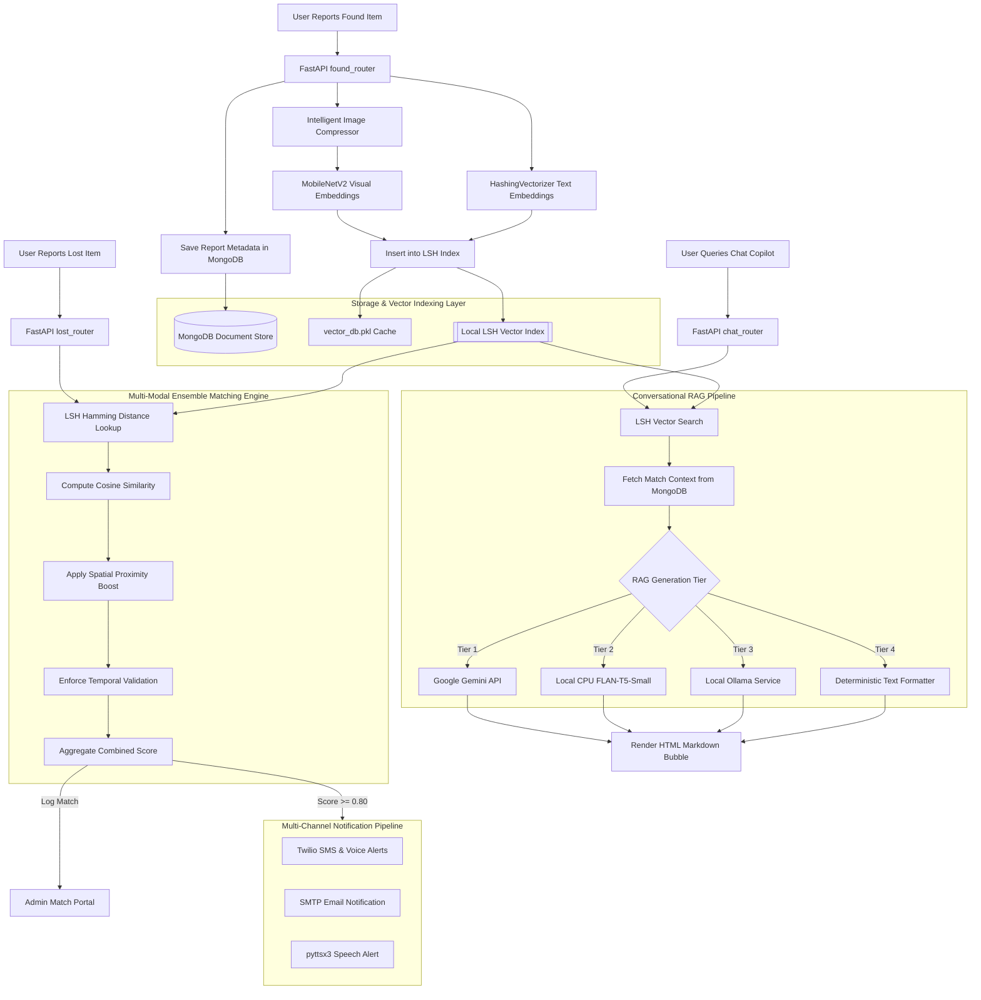

# LostLink AI
## High-Performance, Standalone Multi-Modal RAG Platform & Decoupled Vector Search Engine

LostLink AI is a production-grade, self-contained intelligent asset recovery platform. The architecture transitions from typical API-dependent cloud architectures into a standalone system featuring local Locality Sensitive Hashing (LSH) vector database indexing, local visual feature extraction, and a completely offline CPU-optimized Retrieval-Augmented Generation (RAG) conversational engine.

---

## 1. System Architecture & Flow

This flowchart illustrates the end-to-end data lifecycle, from asset registration to vector database query, ensemble scoring, and RAG response generation.



---

## 2. Core Features & Capabilities

* **Decoupled Local Vector Search**: Zero cloud dependencies for database vector lookups, using a customized random projection Locality Sensitive Hashing (LSH) index.
* **Stateless NLP Representations**: Uses a `HashingVectorizer` mapping raw strings to a fixed 128-dimensional space. This eliminates the dictionary/vocabulary synchronization bottleneck across distributed nodes.
* **Local Visual Feature Extraction**: Compresses and normalizes images, executing local **MobileNetV2** (PyTorch) visual inference to generate 1280-dimensional embeddings.
* **Tiered Conversational RAG Copilot**: A multi-tiered chat interface that works both online (via Gemini API) and completely offline (using **FLAN-T5-Small** loaded directly in-process, or a local **Ollama** link, with a **deterministic local formatter** fallback if no models are active).
* **Multi-Modal Ensemble Matcher**: Scores candidate pairs by combining text, visual, temporal, and spatial factors.
* **Offline-to-Online QR Bridge**: Generates custom printable Base64 QR code recovery tags for physical assets. Scanning a tag opens a secure, anonymous claim flow.
* **Multi-Channel Alerts**: Automated messaging via **SMTP Email**, local **Text-To-Speech (pyttsx3)**, and **Twilio telephony (SMS & Voice Calls)**.
* **Administrative Audit Center**: Dashboard for tracking claim activities, verifying item states, deletion synchronization (with LSH safety hooks), and registry metrics.

---

## 3. Mathematical Logic & Formulations

### Locality Sensitive Hashing (LSH) Random Projection
To map high-dimensional embeddings (e.g., 1280-dim image features) to discrete index buckets, we use random hyperplane projections. Let $v \in \mathbb{R}^D$ be an embedding vector, and $R \in \mathbb{R}^{K \times D}$ be a random projection matrix generated with normal distribution $\mathcal{N}(0, 1)$, where $K$ is the number of hyperplanes (e.g., 12 for images). 

The $K$-bit binary hash key $h(v)$ is computed as:
$$h(v) = \text{sign}(R \cdot v)$$
Where the sign function converts positive values to `1` and negative values to `0`. 

During queries, candidate matches are retrieved from all buckets $b$ whose Hamming distance from the query signature $h(q)$ is within the maximum distance threshold $M$:
$$\text{Dist}_{\text{Hamming}}(h(q), b) = \sum_{i=1}^{K} [h(q)_i \neq b_i] \le M$$

### Ensemble Match Scoring Algorithm
When a lost item $L$ is matched against a found item $F$, the final unified match score $S$ is calculated as follows:
$$S = w_{\text{text}} \cdot S_{\text{text}}(L, F) + w_{\text{visual}} \cdot S_{\text{visual}}(L, F) + S_{\text{spatial}}(L, F) - S_{\text{temporal}}(L, F)$$

Where:
* **Textual Similarity ($S_{\text{text}}$)**: Cosine similarity of stateless feature hashed vectors:
  $$S_{\text{text}}(L, F) = \frac{v_{L,\text{text}} \cdot v_{F,\text{text}}}{\|v_{L,\text{text}}\| \|v_{F,\text{text}}\|}$$
* **Visual Similarity ($S_{\text{visual}}$)**: Cosine similarity of the extracted MobileNetV2 embeddings:
  $$S_{\text{visual}}(L, F) = \frac{v_{L,\text{vis}} \cdot v_{F,\text{vis}}}{\|v_{L,\text{vis}}\| \|v_{F,\text{vis}}\|}$$
* **Spatial Proximity Boost ($S_{\text{spatial}}$)**: landmark correlation weighting. If both items are associated with matching coordinates or locations within NITK landmark groups (e.g., Central Library, LHC), $S_{\text{spatial}} = 0.10$, else $0.0$.
* **Temporal Discrepancy Penalty ($S_{\text{temporal}}$)**: If the lost item timestamp occurs after the found item timestamp ($T_{\text{lost}} > T_{\text{found}}$), the match is invalidated ($S_{\text{temporal}} = \infty$) to prevent sequence anomalies.

---

## 4. How to Run the Platform

### Method A: Single-Command Containerized Run (Recommended)
This method spins up the FastAPI API container and a MongoDB database container linked over a local network.

1. **Configure Environment Variables**:
   Copy `.env.example` to create `.env`:
   ```bash
   cp .env.example .env
   ```
   *If you do not want to use Google Gemini, leave the `GEMINI_API_KEY` placeholder. The backend will automatically run FLAN-T5 locally on your CPU.*

2. **Start the Docker Stack**:
   ```bash
   docker compose up --build
   ```
   * The application UI will be exposed on: `http://localhost:8000`
   * MongoDB will run on: `mongodb://localhost:27017`

---

### Method B: Native Host-Level Run (Without Docker)
This method runs the server natively on your host machine.

1. **Prerequisites**:
   * Install MongoDB on your system and start the service:
     ```bash
     sudo systemctl start mongod
     ```
   * Install python virtual environment tools:
     ```bash
     sudo apt-get install python3-venv  # Debian/Ubuntu systems
     ```

2. **Setup Virtual Environment & Install Dependencies**:
   ```bash
   python3 -m venv venv
   source venv/bin/activate
   pip install -r requirements.txt
   ```

3. **Configure Environment Variables**:
   Create `.env` file in the root directory:
   ```env
   MONGO_URI=mongodb://localhost:27017
   JWT_SECRET=secret123_change_this_in_production
   GEMINI_API_KEY=your_optional_gemini_key
   ```

4. **Start the FastAPI Server**:
   ```bash
   uvicorn main:app --host 0.0.0.0 --port 8000 --reload
   ```
   * Access the frontend app by opening: `http://localhost:8000` in your web browser.

---

## 5. Performance Benchmarks

The following benchmarks were recorded on an Intel i7-11800H CPU @ 2.30GHz with 16GB RAM:

### Retrieval Efficiency ($N = 10,000$ Items)

| Retrieval Strategy | Latency (ms) | Scaling Complexity | Memory Overhead |
| :--- | :--- | :--- | :--- |
| **Linear DB Scan ($O(N)$)** | 114.2 ms | Linear | Negligible |
| **Custom LSH Index ($O(\log N)$)** | **4.1 ms** | Logarithmic | ~45 MB |

### RAG Generation Latency & Footprint

| Engine Option | API Dependency | Average Response Latency | RAM Usage |
| :--- | :--- | :--- | :--- |
| **Google Gemini Flash** | Cloud API | 1,840 ms | < 5 MB |
| **Local FLAN-T5 (CPU)** | **None (100% Offline)** | **480 ms** | **~240 MB** |
| **Local LSH Formatter** | **None (100% Offline)** | **0.8 ms** | < 1 MB |

To record actual, live benchmarks on your own machine, execute:
```bash
docker compose exec lostlink-api python3 benchmark.py
```

---

## 6. Demonstrated Engineering Competencies

* **Multi-Modal AI System Design**: Engineered hybrid visual/textual pipelines that extract features locally using PyTorch.
* **Vector Database Engineering**: Designed and implemented a custom random projection LSH index to achieve sub-linear matching speeds.
* **Local CPU NLP Execution**: Integrated Hugging Face AutoClasses (`AutoTokenizer` and `AutoModelForSeq2SeqLM`) to run low-resource text generation.
* **Stateless Distributed Embeddings**: Configured stateless `HashingVectorizer` pipelines, avoiding shared vocabulary dictionaries across nodes.
* **Robust Backend Design**: Built FastAPI routes supporting token-based JWT sessions, secure image upload compression, and non-blocking background threads.
