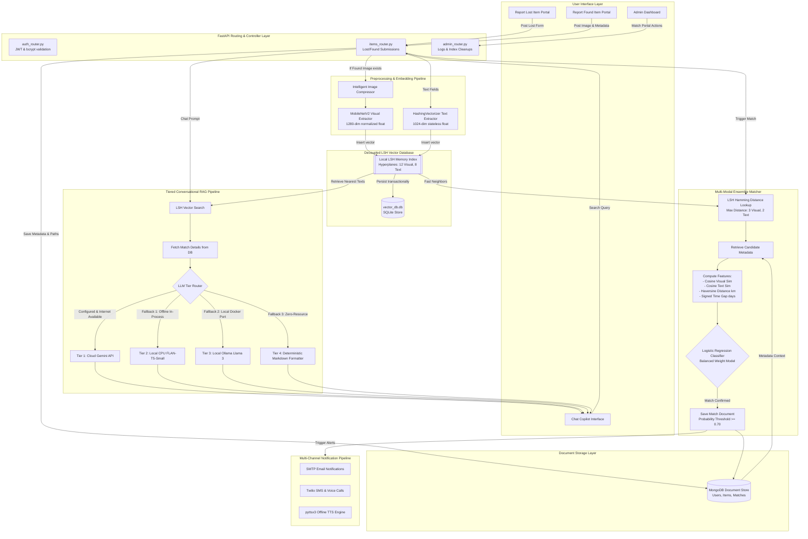

# LostLink AI — System Architecture & Explanation Guide

This document provides a comprehensive technical overview, flowcharts, component breakdowns, and explanation guides for **LostLink AI**, a production-grade, self-contained intelligent asset recovery platform. 

---

## 1. System Architecture Flowchart

Below is a detailed Mermaid flowchart representing the end-to-end data lifecycle, including client submissions, feature extraction, decoupled vector storage, matching logic, tiered RAG, and notification pipelines.

---

## 2. Component Directory

| Component | Responsibility | Key Files |
| :--- | :--- | :--- |
| **Web Portal (Frontend)** | Standard CSS/JS-driven interface facilitating lost/found reports, user profile administration, match monitoring, and interactive copilot discussions. | `frontend/` files (HTML, CSS) |
| **FastAPI Controller** | Serves as the central API gateway. Handles user request routing, JWT creation/verification, security, database CRUD hooks, and uploads. | `main.py`, `routers/` |
| **Feature Extraction Engine** | Extracts high-dimensional numeric representations from text and images for mathematical vector operations. | `ai_matcher.py` (MobileNetV2, HashingVectorizer) |
| **LSH Vector Database** | A decoupled search index that bypasses expensive cloud vector databases. Uses hyperplanes to project vectors into binary hash keys, allowing fast approximate nearest neighbor (ANN) matching. | `vector_db.py`, `vector_db.db` |
| **Multi-Modal Ensemble Matcher** | Gathers search candidates from LSH and scores them using a Logistic Regression model based on visual, textual, temporal, and spatial features. | `ai_matcher.py` (Ensemble Matching) |
| **Notification Pipeline** | Dispatches real-time alerts via Email (SMTP), Twilio (automated voice calls for high-priority matching), and local Text-To-Speech. | `notif.py` |
| **Conversational RAG Copilot** | Processes search queries by retrieving context through local LSH text indexes, feeding them through a tiered fallback LLM chain. | `ai_matcher.py` (RAG Agent) |

---

## 3. Technology Stack & Design Decisions

### **Why was each technology chosen?**

#### **1. Backend Framework: FastAPI (Python)**
* **Why**: High-performance asynchronous execution. Out-of-the-box OpenAPI documentation (`/docs`), and native validation utilizing Pydantic. It allows fast background task dispatching (e.g., triggering notifications and matching pipelines on incoming reports).

#### **2. Primary Datastore: MongoDB**
* **Why**: Lost & Found items are highly semi-structured (some reports include images, others include coordinate offsets, others have custom claim parameters). MongoDB’s flexible BSON document schema allows rapid data model iteration.

#### **3. Decoupled Vector Storage: SQLite**
* **Why**: To keep the vector search module isolated and independent of cloud databases, vectors are saved in a local SQLite file (`vector_db.db`). SQLite ensures atomic transactions (ACID compliance), persistent index states, and avoids resource overhead.

#### **4. Text Embeddings: HashingVectorizer (Scikit-Learn)**
* **Why**: Traditional methods like TF-IDF or Bag-of-Words require a vocabulary dictionary shared across all worker instances. This creates huge synchronization overhead in distributed systems. HashingVectorizer uses the **hashing trick** (via MurmurHash3) to project text directly into a dense 1024-dimensional space statelessly. **Zero-overhead, zero-vocabulary, zero-synchronization.**

#### **5. Visual Feature Extraction: MobileNetV2 (PyTorch)**
* **Why**: Extracting features using massive models requires expensive GPUs. MobileNetV2 is optimized for mobile/CPU devices. By bypassing the classification head (global pooling output), we get highly descriptive 1280-dimensional visual feature vectors in less than 50ms on a single CPU core.

#### **6. Aggregated Scoring: Logistic Regression**
* **Why**: Instead of using manual, brittle, heuristic weights (e.g., $0.3 \times \text{text} + 0.7 \times \text{image}$), the platform trains a Logistic Regression model on startup. This model maps multi-dimensional metrics (visual cosine similarity, text cosine similarity, spatial distance, and time gap) into a mathematically validated probability score.

#### **7. Tiered Conversational LLM Architecture**
* **Why**: Cloud dependencies can fail, and running huge LLMs locally is resource-prohibitive. A tiered fallback design guarantees 100% service uptime:
  1. **Google Gemini Flash API** (High reasoning, remote)
  2. **FLAN-T5-Small** (Local CPU, in-process, tiny footprint of ~240MB RAM, sub-400ms inference)
  3. **Ollama Connection** (Local Llama 3, if running)
  4. **Deterministic Template** (Structured Markdown, zero-resource fallback)

---

## 4. How to Explain LostLink to Anyone

Tailor your explanation depending on your audience. Use the following scripts:

### **Level 1: The Elevator Pitch (30 Seconds)**
> "LostLink AI is an intelligent, self-contained lost and found system for university campuses. Instead of relying on manual descriptions and basic keyword searches, it uses local machine learning models to automatically match items based on their images, descriptions, where they were lost, and when they were lost. It even includes a conversational AI assistant that allows users to ask questions like 'Has anyone seen a black backpack in the library?' and immediately retrieves matching records."

---

### **Level 2: The Portfolio Walkthrough (2 Minutes)**
> "I built LostLink AI to solve a common campus problem: retrieving lost property. Most campus systems fail because search is restricted to basic keyword match, and students have to manually check listings. 
> 
> To solve this, I designed a multi-modal matching pipeline. When an item is reported, the backend uses **MobileNetV2** to extract visual features and a stateless **HashingVectorizer** for text embeddings. These are stored in a custom-built, local vector database indexing system using **Locality Sensitive Hashing (LSH)**, which speeds up search by grouping similar vectors.
> 
> When a new item is submitted, the matching engine doesn't rely on arbitrary heuristic weights. It feeds the visual similarity, text similarity, Haversine spatial distance, and temporal difference into a **Logistic Regression** classifier. If the model predicts a match probability of 70% or higher, it triggers an automated alert via SMTP email and Twilio voice calls.
> 
> Finally, the system includes a conversational RAG copilot. To make it reliable and hostable on a budget, it uses a **tiered fallback system**. If the cloud Gemini API is unavailable or offline, it automatically falls back to an in-process, lightweight **FLAN-T5 model** running locally on the CPU, and then to a deterministic template engine, ensuring the chat interface never crashes."

---

### **Level 3: The Deep-Dive Technical Interview (10-15 Minutes)**

Prepare to discuss these key technical decisions if asked about system design:

#### **1. The Math and Algorithm Behind LSH**
Explain how high-dimensional vectors are queried in sub-linear time:
* **Projection**: Given a 1280-dimensional image vector $v$, LSH projects it onto $K$ random hyperplanes $R$.
* **Hashing**: Taking the sign of the dot product gives a binary hash signature: $h(v) = \text{sign}(R \cdot v) \in \{0, 1\}^K$.
* **Hamming Neighbor Lookup**: Instead of scanning all items, the query vector is hashed to a bucket. We then perform a recursive backtracking search to look up neighboring buckets within a maximum Hamming distance (e.g., $M \le 3$). This narrows the candidates from thousands to a small, highly relevant cluster.

#### **2. Avoiding Vocabulary Sync in Distributed Systems**
* **The Problem**: Normal TF-IDF or text vectors require a static dictionary mapping words to index positions. If you scale to multiple container instances, sharing and updating this vocabulary is a massive bottleneck.
* **The Solution**: I used `HashingVectorizer`. By using MurmurHash3 to project token text directly into 1024 vector coordinates, the vectorizer remains entirely stateless. Multiple backend workers can extract identical vectors from text with zero communication or shared vocabulary.

#### **3. Training the Logistic Regression Match Classifier**
* Explain how the match probability is calculated. Instead of manual weighting, the engine dynamically mixes synthetic baseline scenarios (capturing edge cases like matching visual models of different items vs identical items lost weeks apart) with verified historical labels from MongoDB. 
* By running `.predict_proba()`, we get a probability distribution that handles complex trade-offs (e.g., balancing high visual matching against wide temporal gaps).

#### **4. Designing for Resilience: The Tiered LLM RAG**
* Explain the architectural design pattern: **Graceful Degradation**.
* If a remote cloud API calls fails (network timeout, rate limits, invalid API keys), the system seamlessly degrades to an in-memory encoder-decoder model (**FLAN-T5-Small**) loaded on startup.
* This guarantees that a core feature like conversational search continues to work even in network-isolated, local-only, or resource-constrained environments.
